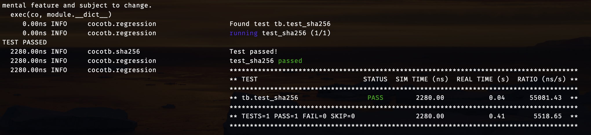

# 18-224/624 S25 Tapeout Template

1. Add your verilog source files to `source_files` in `info.yaml`. The top level of your chip should remain in `chip.sv` and be named `my_chip`

  
  

2. Optionally add other details about your project to `info.yaml` as well (this is only for GitHub - your final project submission will involve submitting these in a different format)

3. Do NOT edit `toplevel_chip.v`  `config.tcl` or `pin_order.cfg`

 # Final Project Submission Details 
  
1. Your design must synthesize at 30MHz but you can run it at any arbitrarily-slow frequency (including single-stepping the clock) on the manufactured chip. If your design must run at an exact frequency, it is safest to choose a lower frequency (i.e. 5MHz)

  

2. For your final project, we will ask you to submit some sort of testbench to verify your design. Include all relevant testing files inside the `testbench` repository

  
  

3. For your final project, we will ask you to submit documentation on how to run/test your design, as well as include your project proposal and progress reports. Include all these files inside the `docs` repository

  
  

4. Optionally, if you use any images in your documentation (diagrams, waveforms, etc) please include them in a separate `img` repository

  

5. Feel free to edit this file and include some basic information about your project (short description, inputs and outputs, diagrams, how to run, etc). An outline is provided below

# Final Project Example Template

This is an example outline you can modify and use in your final project submission. You are not required to use this exact template

## Project Name

A short description of what your project does and how it works. Feel free to include images

## IO

An IO table listing all of your inputs and outputs and their function, like the one below:

| Input/Output	| Description|																
|-------------|--------------------------------------------------|
| io_in[0]    | start signal to start the entire system          |
| io_in[1]    | valid_in signal, raise when input is valid       |
| io_in[11:2] | message_in, data input                           |
| io_out[0]   | valid_out signal, raise when output is valid     |
| io_out[10:1]| hash_out, data output                            |

## Verification

A Cocotb testbench is provided in the /testbench folder. The testbench generates a random message and checks the output hash value. 
You should see this output, which means the generated sha256 hash matches the correct hash:

## How to Test

A short description of how to test the design post-tapeout
